<!--
  PROFILE README for Shahmir Gill.
  Renders on the GitHub profile of the account this repo is named after
  (repo name must exactly match the account/org handle). Widths 370/490 keep the
  ASCII portrait and info card the same height -- re-match them if you change the
  info card's H in scripts/make_info_card.py.

  Regenerate the art:  python scripts/make_brand_svg.py     # infinity logo card
                       python scripts/make_info_card.py     # neofetch info panel
  (An ASCII-portrait card is also available via scripts/make_ascii_svg.py.)
  The contribution graph refreshes itself daily (.github/workflows/update-profile-art.yml).
  Project/template docs live in TEMPLATE.md.
-->

<table>
<tr>
<td valign="top"></td>
<td valign="top"></td>
</tr>
</table>

## Shahmir Gill

**Founder @ [InfinitySell.io](https://infinitysell.io) · AI Automation &amp; CRM Lead · n8n Systems Builder**

 

<!-- animated contribution graph, refreshed daily by the workflow -->

